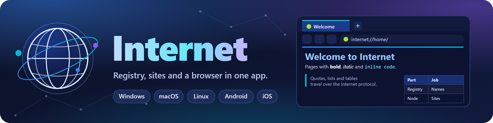

  

# Internet

A custom Internet written in C++17 that runs on Windows, macOS, Linux, Android and iOS.

## Parts

- **Registry**: maps node names to addresses (like DNS). Entries expire after 180 seconds unless refreshed, and nodes unregister themselves when they stop.
- **Node**: serves a directory of files under a name, with content types, generated directory listings and path-traversal protection.
- **Client**: resolves `internet://name/path` through the registry and fetches it from the node.
- **Internet app**: a graphical browser that can also run a registry and host sites. It renders HTML (headings, paragraphs, bold and italic text, inline code, bulleted and numbered lists, quotes, tables, images, links, rules, preformatted text), shows plain text, and saves binary files.
- **`internet` command**: the same features for the terminal.
- **`internet-server`**: a headless server that hosts every folder of a directory as a site, runs a registry and exposes a JSON API.
- **Security**: an antivirus engine, quarantine and firewall built into the app, the command line and the server.
- **Gateway**: lets Chrome and other browsers open `internet://` sites through a local HTTP address, with the same protection.

## Build

### Windows, macOS and Linux

    cmake -S . -B build -DCMAKE_BUILD_TYPE=Release
    cmake --build build --config Release
    ctest --test-dir build -C Release

This produces `internet` (command line), `internet-server`, `internet-app` (graphical app, called `Internet.app` on macOS) and `internet-tests`.
The app downloads GLFW and Dear ImGui at configure time. Use `-DINTERNET_BUILD_APP=OFF` to build only the command line tools.
Use `-DINTERNET_APP_BACKEND=SDL` to build the desktop app on the same SDL3 backend the phones use.

On Linux install the X11 and OpenGL development packages first:

    sudo apt-get install libx11-dev libxrandr-dev libxinerama-dev libxcursor-dev libxi-dev libgl1-mesa-dev

Run `cpack --config build/CPackConfig.cmake -C Release` to create a `.zip` (Windows, macOS) or `.tar.gz` (Linux).

### Android

Needs JDK 17, the Android SDK and NDK, and Gradle 8.10.

    git clone --depth 1 --branch release-3.2.30 https://github.com/libsdl-org/SDL.git android/SDL
    gradle -p android assembleDebug

The APK is written to `android/app/build/outputs/apk/debug/`. Add `-PinternetAbis=arm64-v8a` to build a single architecture and `-PinternetNdk=<major.minor.micro>` to pick an NDK. If CMake is not installed in the Android SDK, point `cmake.dir` in `android/local.properties` at a CMake install.

### iOS

Needs macOS with Xcode.

    cmake -S . -B build-ios -G Xcode -DCMAKE_SYSTEM_NAME=iOS -DCMAKE_OSX_SYSROOT=iphoneos \
        -DCMAKE_OSX_ARCHITECTURES=arm64 -DCMAKE_OSX_DEPLOYMENT_TARGET=13.0 \
        -DCMAKE_XCODE_ATTRIBUTE_CODE_SIGNING_ALLOWED=NO
    cmake --build build-ios --config Release

The result is an unsigned `Internet.app`. Sign it with your own Apple developer identity (or a sideloading tool) before installing it on a device.

### Continuous integration

`.github/workflows/build.yml` builds, tests and packages Windows, macOS and Linux, builds the Android APK, and builds the unsigned iOS app.

## Icon

The app icon is drawn by code in `src/app/icon.cpp`. To regenerate every icon file (Windows `.ico`, macOS `.icns`, Android launcher icons, iOS icons):

    cmake -S . -B build -DINTERNET_BUILD_TOOLS=ON
    cmake --build build --target internet-icons
    build/internet-icons .

The window icon is rendered from the same code at startup.

The banner at the top of this file is drawn in `assets/banner.svg`. To export it to `assets/banner.png` with Chrome:

    chrome --headless=new --hide-scrollbars --default-background-color=00000000 --screenshot=assets/banner.png --window-size=1280,320 --force-device-scale-factor=2 file:///path/to/assets/banner.svg

## The app

Start `internet-app`. An animated intro plays (click or press any key to skip), then the home screen opens. Press **Quick start** to run a registry, host the sample site and open `internet://home/`.

- **Home screen**: an animated hero, a search box, action cards (Quick start, Host a site, Start or stop a registry, Edit site, Find a site), the sites that are online, your bookmarks and your recent pages.
- **Tabs**: open as many as you like with the `+` button. Each tab has its own history, shows a colored avatar for its site (a spinner while it loads) and a tooltip with the full title and address, and the status bar shows how many are open.
- **Address bar**: a badge shows which site you are on, turns into a search icon while you type, and gets a warning ring when the page is suspicious or blocked.
- **Web links**: when the server you are connected to has a web address (see below), **Share** gives you a link such as `https://blog.example.com/page` that opens in any browser, on any device, even without the app. The address is detected from the server, or you can type it in the **Web link** section of the sidebar, which also has buttons to copy the web link or the `internet://` link. Pasting a web link of that server into the address bar, or clicking one in a page, opens it in the app. Any other web address opens in your default browser.
- **Account**: on a server that supports it, **Sign in with Google** keeps your bookmarks, history and settings on every device and lets you create sites, list them and upload the folder you host (see below).
- **Reading**: text sits in a centered column that is easy to read on wide windows, a progress line under the toolbar shows how far you have scrolled, a round button brings you back to the top, and the sidebar lists the headings under **On this page** so you can jump to any of them.
- **Command palette** (`Ctrl+K`): type a few letters to run any action, open a site, a bookmark or a recent page, switch the theme, or jump to a file in the editor.
- **Site editor**: see below.
- **Registry**: the address the app uses, plus a button to run a registry on this computer.
- **Host a site**: pick a name and a folder to serve it as `internet://name/`, then copy or share the link.
- **Directory**: every node currently registered, click one to open it.
- **Bookmarks and history**: the star saves a page, the home screen lists bookmarks and recent pages, and both are kept between runs.
- **Find in page** highlights matching words, and page zoom goes from 60% to 250%.
- **Appearance**: five accent palettes (Ocean, Sunset, Forest, Violet, Candy), and switches for the intro and the animated backgrounds. The sidebar can be hidden with `Ctrl+B`.
- **Source** shows the raw page. Binary files offer a save button that writes to `downloads/`.

Shortcuts: `Ctrl+K` command palette, `Ctrl+T` new tab, `Ctrl+W` close tab, `Ctrl+Tab` next tab, `Ctrl+E` site editor, `Ctrl+S` save, `Ctrl+B` sidebar, `Ctrl+L` address bar, `Ctrl+F` find, `Ctrl+D` bookmark, `Ctrl+H` home, `F5` reload, `Alt+Left` and `Alt+Right` back and forward, `Ctrl` with `+`, `-` or `0` for zoom.

Settings, bookmarks and history are stored in `settings.txt`, `bookmarks.txt` and `history.txt` inside the app's data folder (`%APPDATA%\Internet` on Windows, `~/Library/Application Support/Internet` on macOS, `~/.local/share/Internet` on Linux).

## Page elements

The app understands this HTML. Other tags are ignored, but the text inside them is still shown.

| Element | Tags |
| --- | --- |
| Headings | `h1` to `h6` |
| Text | `p`, `div`, `br`, `section`, `article`, `aside`, `figure` |
| Emphasis | `b`, `strong` (bold), `i`, `em`, `cite` (italic), `u`, `ins` (underline), `s`, `del`, `strike` (strikethrough), `mark` (highlight) |
| Code | `code`, `kbd`, `samp`, `tt` (inline), `pre` (block) |
| Lists | `ul`, `ol` (with `start`), `li`, nested to any depth |
| Quotes | `blockquote`, nested |
| Tables | `table`, `caption`, `tr`, `th`, `td` |
| Images | `img` is shown as a card with its description, and clicking it opens the file |
| Links | `a href`, including `#name` links that scroll to an `id` or `a name` on the same page |
| Rules | `hr` |

Scripts and styles are never run. Bold and italic are drawn by the app itself, so they work with any font.

## The site editor

Press the pencil button, `Ctrl+E`, or the **Edit site** card to edit the folder you host.

- **Files**: a tree of the site folder. Create pages and folders from templates (blank page, article, landing page, link list, documentation), rename them, delete them. Names are checked so nothing can escape the site folder.
- **Editor**: a monospaced text editor with snippet buttons (headings, text, links, lists, numbered steps, quote, table, image, rule, bold, italic, mark, inline code, code block) that insert at the cursor, and a **Page link** picker that lists the pages of your site.
- **Live preview**: shows the page as you type. Choose **Split**, **Edit** or **Preview**.
- **Save** with `Ctrl+S`. Unsaved files are marked in the tree and in the tab title, and switching files asks before discarding changes. If the saved page is open in a tab it reloads.
- **Publish** starts hosting (and a registry when none is reachable) and opens the live site.

## Phones and tablets

On narrow screens (phones, small windows) the app switches to a single column: the Menu button opens the sidebar and the page fills the screen. In the editor the **Files**, **Edit** and **Preview** buttons switch between the three panes. Dragging scrolls, tapping a link opens it, and the Android back button goes back.

Native integration:

- **Android**: the share button opens the system share sheet, taps give a short vibration, `internet://` links from other apps open in the app, and hosting a site starts a foreground service with a notification so the site stays online while the app is in the background.
- **iOS**: the share button opens the share sheet, taps give haptic feedback, and `internet://` links open the app. iOS suspends apps in the background, so hosting pauses when you leave the app.
- Hosted sites and downloads live in the app's private data folder.

The app also accepts launch options: `--registry host:port`, an `internet://` URL, `--security [tab]` and `--scan <path>`.

## Security

The engine lives in `src/core` and is shared by the app, the command line and the server.

- **Scanner**: SHA-256 reputation, byte-pattern rules matched with Aho-Corasick, file type detection, script, PE and ELF heuristics, name heuristics (double extensions, executables posing as documents) and archive inspection for zip, tar and gzip (nesting, path traversal, link escapes, setuid files, bombs, encrypted entries). Every file gets a score: 85 and above is malicious, 50 and above is suspicious. Inside an archive each file is scored on its own, so many mildly suspicious scripts do not add up to a false alarm.
- **Go protection**: Go source (`.go`, recognised even under another name), `go.mod`, `go.sum` and programs compiled with Go (Windows, Linux and macOS) get their own checks.
  - *Source*: reverse shells, shellcode loaders, raw system-call loaders, AMSI and ETW patching, ransomware, download and run, keyloggers, clipboard hijackers, `//go:generate` that downloads code, `//go:embed` payloads that are unpacked and run, `init` functions that call the network or start programs, huge byte arrays and strings built byte by byte.
  - *Supply chain*: every imported or required module is compared with a list of well known modules. A path that is one or two letters away from a popular module but has a different owner (`github.com/gorrila/mux`) is flagged as a typosquat, and so are modules loaded from bare IP addresses, tunnels or paste sites and attack frameworks such as Sliver or Merlin. The same review runs on the dependency list that Go writes into every compiled program.
  - *Compiled programs*: the Go build information (version, dependencies, build flags) is read, the runtime tables identify even stripped programs, and capability rules (shellcode loading, AMSI patching, ransomware, keylogging, clipboard swapping, persistence) run on compact programs. Large programs with many dependencies, such as `gh` or `git-lfs`, are not judged by the standard library calls they make.
  - Scan results show the language, for example `Go (go1.25.5)`.
- **Real-time protection**: pages are scanned before they are shown, downloads are refused when malicious, files are scanned when saved in the editor, and hosted sites never serve a malicious file (status `451`).
- **Quarantine**: dangerous files found by a scan are moved to `security/quarantine` in the data folder, scrambled, and can be restored or deleted.
- **Firewall**: rate limit, connection limit and temporary bans for abusive computers. Loopback is never limited. The registry also reserves names such as `api` and limits how many names one computer can register.
- **Definitions**: rules and hashes ship inside the program (`definitions/builtin.def`, packed into `src/core/builtin_defs.inc` with `tools/pack_defs.cpp`) and can be updated from a file or an `internet://` address with `internet av update <source>` or from the Security Center. A rule can limit where it applies with a scope (`html`, `script`, `shell`, `pe`, `pexe`, `elf`, `text`, `archive`, `pdf`, `go`, `gobin`, `gotiny`, `other`, `any`) and can widen its proximity window with `window <bytes>` or `window any`.
- **Security Center**: open it with the shield button or `Ctrl+J` for the overview, scans, quarantine, firewall statistics and settings. **Test protection** scans a harmless test marker (`Internet.Test.Marker`) to show that the engine works, and the overview lists what is covered.

This is a compact engine written for this project. It finds what its rules and hashes describe and flags suspicious behaviour, but it is not a replacement for a commercial antivirus.

## The server

    internet-server init [--dir D] [--public] [--public-host H] [--domain D] [--https]
    internet-server run [--dir D]
    internet-server scan [--dir D]
    internet-server token [--dir D]

`init` creates the directory with `sites/`, `data/` and `server.conf`. `run` starts a registry, a browser gateway (`gateway_port`, default 8080), an API node and one node per folder under `sites/` (folders added or removed while it runs are picked up), scans everything on start and periodically afterwards, and logs to `data/server.log`. The API token is in `data/token.txt`.

## Running a server online

By default the server is meant for your own computer or network. To serve visitors from the whole internet, run it on a machine with a public address (a VPS, or a home server with forwarded ports) and create its settings with `--public`:

    internet-server init --dir /var/lib/internet --public --domain example.com

`--public` opens the browser gateway to the network, closes the registry so that only the server itself can register sites, and gives the sites a fixed port range. `--domain` is the name browsers use, `--public-host` is the address the app and command line use when it is not the same (an IP address, for example), and `--https` makes the addresses shown by the gateway start with `https://`.

### What visitors use

- **Internet app and command line**: the server's registry, for example `internet get internet://home/ --registry example.com:4000`, or `example.com:4000` in the Registry box of the app. Sites registered on the server are announced with the public address, and a registry that answers with a loopback address is understood as its own address. The public `GET /v1/status` also reports the server's web address (`web`, for example `https://example.com`), which is how the app knows to offer web links.
- **Ordinary browsers**: `http://example.com/` shows the index and every site is at `http://NAME.example.com/`. This needs a wildcard DNS record, `*.example.com`, pointing at the server. Without a domain of your own, use a wildcard address service such as sslip.io: `--domain 203-0-113-9.sslip.io` for a server at 203.0.113.9.

### Ports to open

| Port | Use |
| --- | --- |
| `4000` | registry (`registry_port`) |
| `4100` to `4199` | the sites and the API (`node_port_start`, `node_port_count`), one port each |
| `8080` | web gateway (`gateway_port`), or `80` and `443` behind a proxy |

### With Docker

    docker compose up -d --build

Set `INTERNET_DOMAIN` and `INTERNET_PUBLIC_HOST` in a `.env` file next to `docker-compose.yml`. The settings and sites live in the `internet-data` volume, and the compose file publishes the gateway on port 80. For HTTPS use `docker compose -f docker-compose.https.yml up -d --build` with `INTERNET_DOMAIN` set: a Caddy container gets a certificate for `example.com` and for every site that exists, asking the gateway (`/_ask`, answered only to the proxy) before it requests one. Let's Encrypt limits how many certificates one domain can get per week, so a server with many sites should use a wildcard certificate instead.

### Without Docker

    cmake -S . -B build -DINTERNET_BUILD_APP=OFF && cmake --build build
    sudo cmake --install build
    sudo useradd --system --create-home --home-dir /var/lib/internet internet
    sudo -u internet internet-server init --dir /var/lib/internet --public --domain example.com
    sudo cp deploy/internet-server.service /etc/systemd/system/
    sudo systemctl enable --now internet-server

### Settings for a public server

These keys go in `server.conf`:

| Key | Default | Meaning |
| --- | --- | --- |
| `public_host` | empty | address announced for the sites, an IP address or a name |
| `open_registry` | `true` | `false` lets only this server register sites |
| `node_port_start`, `node_port_count` | `0`, `100` | fixed port range for the sites and the API (`0` picks free ports) |
| `gateway_local_only` | `true` | `false` lets the gateway listen on every interface |
| `gateway_domain` | empty | domain that browsers use, sites are `NAME.domain` |
| `gateway_https` | `false` | addresses shown by the gateway use `https://` |
| `gateway_public_port` | `0` | port shown in the addresses, `0` for the default one |
| `google_client_id`, `google_client_secret` | empty | turn on signing in with Google (see above) |
| `google_redirect_uri` | the gateway address plus `/auth/google/callback` | set it only when a proxy changes the address |
| `max_sites_per_account` | `5` | how many sites one signed in person can create |

Every page still passes through Internet Security before it is served, uploads are scanned, and the firewall limits requests and bans abusive hosts. Keep `data/token.txt` secret, because it controls the API. Requests that arrive through a proxy on the same machine look like they come from the machine itself, which the firewall does not limit, so put the rate limits in the proxy.

## Signing in with Google

A public server can let people sign in with their Google account. A signed in person owns the sites they create, can upload to them, and keeps bookmarks, history and settings on every device.

### Set it up

1. In the [Google Cloud console](https://console.cloud.google.com/apis/credentials) create an **OAuth client ID** of type **Web application** (configure the consent screen first, the `openid`, `email` and `profile` scopes need no review).
2. Add the redirect URI to **Authorized redirect URIs**. It is the web address of your gateway plus `/auth/google/callback`, for example `https://example.com/auth/google/callback`. The server prints the exact address when it starts.
3. Give the client ID and secret to the server, either in `server.conf`:

       google_client_id=1234567890-abc.apps.googleusercontent.com
       google_client_secret=GOCSPX-your-secret

   or with the `INTERNET_GOOGLE_CLIENT_ID` and `INTERNET_GOOGLE_CLIENT_SECRET` environment variables (the compose files pass them on). The gateway must be on (`gateway_port`), and `gateway_domain` and `gateway_public_port` decide the address in step 2. To try it on your own computer use `gateway_domain=localhost` and `gateway_public_port=8080`: Google accepts `http://localhost:8080/auth/google/callback` for testing.

The server needs to reach `oauth2.googleapis.com` over HTTPS. Windows uses the system HTTPS client. Linux and macOS builds download and build Mbed TLS (`-DINTERNET_TLS=MBEDTLS`, the default there) and read the system certificates, or the PEM file named by `INTERNET_CA_FILE`. Use `-DINTERNET_TLS=NONE` to build without it, and then signing in is unavailable.

### How it works

- **On the web**: `/login` shows a **Sign in with Google** button, `/account` lists your sites and lets you sign out. The session lives in an `HttpOnly` cookie that is only sent to the gateway's own address, never to the sites.
- **In the app**: when the server offers sign-in, the sidebar shows **Sign in with Google**. The app opens your browser, waits on a temporary local address, and trades a one-time code for a session (the code is bound to a secret that only the app knows). The session is kept in `account.txt` in the app's data folder, and **Sign out** ends it on the server too.
- **Safety**: the sign-in uses the authorization code flow with PKCE and a `state` value, the client secret never leaves the server, the identity comes straight from Google over TLS and is checked (issuer, audience, expiry, verified email), and sessions are stored only as hashes.

### What an account can do

- Create sites (`max_sites_per_account`, 5 by default). Reserved names such as `api`, `admin` and `www` and names that are taken are refused. A person only sees and changes their own sites, and **Upload** in the sidebar sends the files of the folder you host to one of them.
- Keep bookmarks, history and settings (theme, zoom, animations, intro) on the server. Bookmarks and history from your devices are merged, and a change made on one device replaces the older copy on the others. A new device takes your saved settings the first time.
- The administrator token keeps working for everything, and the security endpoints (`/v1/security/...`) are for the administrator only.

Accounts are stored in `data/accounts/` (Google id, email, name and picture address, hashed sessions, site owners and synced data).

## The API

The API is a node named `api`. A request is sent as `API <METHOD> <path> <token>` with an optional JSON or file body, and replies are JSON.

| Method and path | Description |
| --- | --- |
| `GET /v1/status` | server state (public) |
| `GET /v1/sites`, `POST /v1/sites` | list or create sites (`{"name": "..."}`) |
| `GET`, `DELETE /v1/sites/{name}` | show or remove a site |
| `GET /v1/sites/{name}/files` | list files |
| `GET`, `PUT`, `DELETE /v1/sites/{name}/files/{path}` | read, write or delete a file (uploads are scanned, malicious ones return `422`) |
| `POST /v1/sites/{name}/scan` | scan a site |
| `POST /v1/scan/{name}` | scan the request body as if it were a file called `name` |
| `GET /v1/security/status`, `/v1/security/threats` | protection state and recent threats |
| `GET /v1/security/quarantine`, `DELETE /v1/security/quarantine/{id}` | list or delete quarantined files |
| `GET /v1/security/firewall`, `DELETE /v1/security/firewall/bans/{host}` | firewall statistics, lift a ban |
| `POST /v1/security/definitions` | replace the definitions with the request body |
| `POST /v1/session/exchange` | trade a one-time sign-in code (`{"code", "verifier"}`) for a session token (public) |
| `GET /v1/account`, `DELETE /v1/account/session` | the signed in profile and its sites, or sign out |
| `GET`, `PUT /v1/account/sync/{bookmarks,history,settings}` | read or store the synced data of the account |

Everything except `/v1/status` and `/v1/session/exchange` needs the administrator token or the session token of an account. A session token only sees the sites of its account and cannot use `/v1/security/...`. From the terminal (the body of `PUT` and `POST` is read from standard input):

    internet api GET /v1/sites --token <token>
    internet api PUT /v1/sites/home/files/index.html --token <token> < index.html

## Chrome and other browsers

Chrome cannot open `internet://` on its own, so the app, the command line and the server can run a **gateway**: a small HTTP server that fetches a site from the network and hands it to the browser. A site called `shop` is opened at `http://shop.localhost:8080/`, and the gateway home page at `http://localhost:8080/` lists every site that is online and has an address box.

- **Protected**: every page is scanned first. A malicious page is replaced by a block page (status `451`), a suspicious one is shown with a warning bar.
- **Isolated**: each site has its own origin (`name.localhost`), so one site cannot read another's cookies or storage. Scripts are blocked with a Content-Security-Policy unless you allow them, and `internet://` links inside pages are rewritten to gateway links.
- **Local only**: the gateway listens on the loopback interface and refuses requests for any other host name. `--lan` (or `gateway_local_only=false` in `server.conf`) opens it to the network.
- **In the app**: the **Browser** panel on the home screen, the arrow button in the toolbar and the command palette (**Open in Chrome**) start the gateway on port 8080 (or a free port) and open the current page in Chrome. If Chrome is not installed the default browser is used. **Register internet:// links** makes the operating system open `internet://` links in the app, so a link clicked in Chrome asks to open Internet (Windows and Linux; on macOS the link handler is not registered by this build).
- **From the terminal**: `internet gateway --open`, or `internet-server run`, which serves the gateway on `gateway_port` from `server.conf`.
- **Chrome extension**: `extension/chrome` is a small Manifest V3 extension. Open `chrome://extensions`, turn on Developer mode, choose **Load unpacked** and select that folder. Then type `in`, press space and a site such as `home/` in the address bar. The toolbar button opens the gateway home page and the options page sets the gateway port.

## The command line

    internet registry [--port N]
    internet serve <name> <directory> [--port N] [--registry host:port] [--no-guard]
    internet get <internet://name/path> [--registry host:port] [--out file]
    internet list [--registry host:port]
    internet gateway [--port N] [--registry host:port] [--allow-scripts] [--lan] [--no-guard] [--open]
    internet link register|unregister|status
    internet api <METHOD> <path> [--token T] [--out file] [--registry host:port]
    internet av scan <file-or-folder> [--quarantine] [--json]
    internet av info
    internet av update <definitions-file-or-internet-url>
    internet av quarantine list|restore <id> <destination>|delete <id>

The registry defaults to `127.0.0.1:4000`.

    internet registry
    internet serve home sites/home
    internet get internet://home/

## Wire protocol

Every message is one header line followed by a body:

    FIELD FIELD ... <body-length>\n<body>

| Request | Reply |
| --- | --- |
| `REGISTER <name> <port>` | `OK` |
| `UNREGISTER <name> <port>` | `OK` |
| `RESOLVE <name>` | `OK <host> <port>` |
| `LIST` | `OK`, body of `name host port` lines |
| `GET <path>` (to a node) | `OK <content-type>`, body is the file |

The API uses `API <METHOD> <path> <token>`. Errors are `ERR <code>` with `400`, `401`, `403`, `404`, `405`, `409`, `413`, `422`, `429`, `451` or `500`. Paths are percent-encoded, so `a b.txt` is sent as `a%20b.txt`.

## Limits

The registry records the address a node connects from, so nodes on the same computer are found at `127.0.0.1`. Reaching a node from another machine needs the registry to see that node's LAN address, which happens when the node runs on that other machine and registers over the network.
